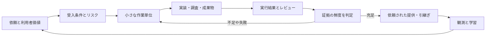

# Keelway

**開発の目的から、検証・提供・運用の学習までをつなぐ、Codex用の開発ハーネス。**

Keelway（キールウェイ）は、進む方向を支える keel と、価値を届け続ける way を重ねた名称です。
技術上のスキル名は互換性のため `$delivery-harness` を維持しています。

Google、Amazon、Netflix、Stripe等が公開している実践を参考に、技術スタックに依存する部分を設定へ分け、
判断の手順と実行可能な証拠管理を組み合わせました。特定企業の社内システムの複製・公式製品ではありません。
同等の組織成果には、実際のCI・運用・所有者・改善活動への接続が必要です。

## 使い始める

### 1. 対象の開発リポジトリに導入

Python 3.10以上を使います。追加パッケージは不要です。ZIPを展開し、このREADMEと同じディレクトリで実行します。

```bash
python3 install.py --target "/path/to/your-repository"
```

Windowsは `py -3 install.py --target "C:\path\to\your-repository"`。
事前に内容を確認する場合は `--dry-run` を付けます。
既存のAGENTSへの追記、スキル、プロジェクト設定の追加だけを行い、Codexのモデル・権限設定は変更しません。
非空の `AGENTS.override.md` がある場合はそちらへ追記します。衝突は上書きせず報告します。

### 2. 対象リポジトリをCodexで開き、最初に依頼

```text
$delivery-harness
このリポジトリにハーネスを接続してください。
既存のAGENTS、実装、CI、テスト、実行方法を確認し、.harness/context.md と
.harness/project.json に実在する情報と検証コマンドを設定してください。
未確認事項を明示し、doctor と適切な確認まで進めてください。
```

以後は通常の依頼に `$delivery-harness` を付けて使えます。スキル一覧に出ない場合は新しいCodexセッションを開いてください。
導入先の `AGENTS.md` からもスキルへ接続します。スキルの検出と指示の探索は
[Codexの公式仕様](https://learn.chatgpt.com/docs/build-skills) に合わせています。

### 3. 仕事を依頼

```text
$delivery-harness
この不具合を再現して修正し、利用者の受入条件に対応した検証まで完了してください。
既存の仕様と差分を確認し、影響に応じた手順を選んでください。
```

「APIを設計して」「移行計画を作って」「この差分をレビューして」「障害原因を調査して」にも同じ入口を使います。
リリース・外部操作は依頼の範囲と既存の権限に従います。

## 構成



| 層 | 内容 |
|---|---|
| Codexの入口 | 短いAGENTS追記と、必要な参照だけ読む `delivery-harness` スキル |
| 業務の進め方 | 企画、調査、要件、設計、実装、レビュー、テスト、移行、提供、障害、運用改善 |
| 案件ごとの接続 | 実際の検証コマンド、重要パス、作業地図、担当と不変条件 |
| 実行ツール | タスク契約、検証実行、受入証拠、レビュー、追加制御、鮮度判定、完了記録 |
| 継続改善 | 所有者、SLO、提供の指標、現実的な評価ケース、導入と見直しの手順 |

## 機械的に確認すること

- 受入条件に証拠が結び付いていることと、参照したファイルが変わっていないこと。
- 該当チェックの実行・終了結果。未設定、未実行、失敗、タイムアウトを成功扱いしないこと。
- 検証後にソース・設定・契約・ハーネスが変わった場合の無効化。
- リスクに応じたレビュー、復旧、観測、互換性、権限境界、データ整合性の記録。
- 未解決の変更要求やblockerが残っていないこと。

**READYはローカル証拠の充足です。** 証拠内容の意味的な正しさ、レビュー担当の本人性、本番承認は別の仕組みが担います。
コマンドは現在の実行権限で動きます。機密を出力するチェックを登録しないでください。
実装系の初期設定は `checks: {}` のため、実プロジェクトのチェックを接続するまでgateは通りません。

軽微で可逆な修正は短い経路を使い、新しい台帳や形式的なレビューを毎回要求しません。
ソースの鮮度判定はルート全体を対象とするため、関係のないファイル変更でも古い証拠になる場合があります。
外部サービス・環境変数・gitignore対象の一般入力は追跡されません。詳しくは[実行ガイド](.agents/skills/delivery-harness/references/runtime.md)。

## 実際に動かす

```bash
# 配布物自体の検証
python3 -m unittest discover -s tests -v

# 独立したサンプルを作成し、失敗→修正→READY→変更後staleを再現
python3 examples/run_demo.py --target "./work/retry-demo"
```

サンプルは既存の空でないディレクトリを変更しません。外部API・公開・デプロイを実行しません。
検証内容と限界は [VALIDATION.md](docs/VALIDATION.md)、設計根拠は [SOURCES.md](docs/SOURCES.md) に記録しています。

## 主なファイル

| ファイル | 用途 |
|---|---|
| [SKILL.md](.agents/skills/delivery-harness/SKILL.md) | Codexが読む共通の進め方 |
| [harness.py](.agents/skills/delivery-harness/scripts/harness.py) | 証拠とチェックの実行ツール |
| [実行ガイド](.agents/skills/delivery-harness/references/runtime.md) | 設定・コマンド・ゲート・制約 |
| [導入と測定](docs/ADOPTION.md) | チームへの接続と改善の運用 |
| [Codex CLIとの連携](docs/CODEX.md) | デスクトップと非対話実行 |
| [評価ケース](evals/cases.json) | ハーネス・モデル変更時の回帰評価 |
| [評価手順](evals/README.md) | 実行結果を根拠に改善する方法 |
| [テンプレート](.agents/skills/delivery-harness/assets/work-templates.md) | 必要な成果物だけ選んで使う型 |

## 取り外し

元の配布ディレクトリから `python3 install.py --target "/path/to/repo" --uninstall`。
ハーネスが追加し、その後変わっていないファイルと追記を取り外します。
利用者が編集したファイル・既存の設定・タスクの証拠は保持します。残った空ディレクトリは必要に応じて削除できます。
この版では自動アップグレード・自動削除・グローバル導入は行いません。
